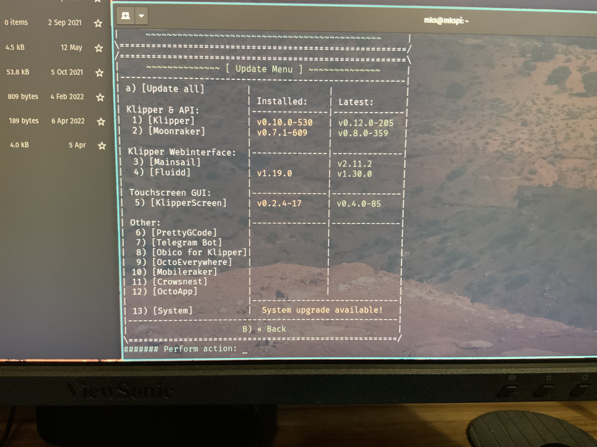

# Qidi X-Smart 3

- [Images](#images)
- [Mods](#mods)
- [Software/Firmware](#softwarefirmware)

------------------------------------------------------------------------

## Images

### Electronics Bay

Images:

- [Overview](images/electronics-bay.jpg)
- [Mainboard](images/mainboard-01.jpg)
- [Mainboard closeup](images/mainboard-02.jpg)
- [Mainboard ports](images/mainboard-ports.jpg)
- [Mainboard pinout](images/mainboard-pins.jpg)
- [Power supply](images/power-supply.jpg)
- [Power switch](images/power-switch.jpg)

#### Notes

Initial inspection found the USB extension cable not fully seated in the
top USB 2.0 port.

## Mods

Mods found in this repository:

- [Fan mod](./fan-mod/README.md): control the mainboard fan with
  Klipper, instead of always on.
- [Config mod](./configs/README.md): fixing Qidi’s copy/paste errors
  and adding functionality.
- [Heater mod](./heater-mod/README.md): active chamber heater mod
- [Camera mod](./camera-mount/README.md): add a webcam

## Software/Firmware

Software/Firmware versions as shipped:

Default ssh login: mks/makerbase

Armbian OS info:

    mks@mkspi:~$ cat /etc/armbian-image-release
    # PLEASE DO NOT EDIT THIS FILE
    BOARD=mkspi
    BOARD_NAME="mkspi"
    BOARDFAMILY=rockchip64
    BUILD_REPOSITORY_URL=https://github.com/armbian/build.git
    BUILD_REPOSITORY_COMMIT=ed589b248-dirty
    VERSION=22.05.0-trunk
    LINUXFAMILY=rockchip64
    ARCH=arm64
    IMAGE_TYPE=user-built
    BOARD_TYPE=conf
    INITRD_ARCH=arm64
    KERNEL_IMAGE_TYPE=Image
    IMAGE_UUID=16031aaf-8c15-492e-97bf-3453cab5322c

    mks@mkspi:~$ cat /etc/armbian-release
    # PLEASE DO NOT EDIT THIS FILE
    BOARD=mkspi
    BOARD_NAME="mkspi"
    BOARDFAMILY=rockchip64
    BUILD_REPOSITORY_URL=https://github.com/armbian/build.git
    BUILD_REPOSITORY_COMMIT=ed589b248-dirty
    VERSION=22.05.0-trunk
    LINUXFAMILY=rockchip64
    ARCH=arm64
    IMAGE_TYPE=user-built
    BOARD_TYPE=conf
    INITRD_ARCH=arm64
    KERNEL_IMAGE_TYPE=Image
    BRANCH=edge

    mks@mkspi:~$ cat /etc/armbian-distribution-status
    bullseye=supported
    impish=csc
    xenial=eos
    stretch=eos
    buster=supported
    hirsute=supported
    sid=csc
    jammy=csc
    focal=supported
    bionic=csc
