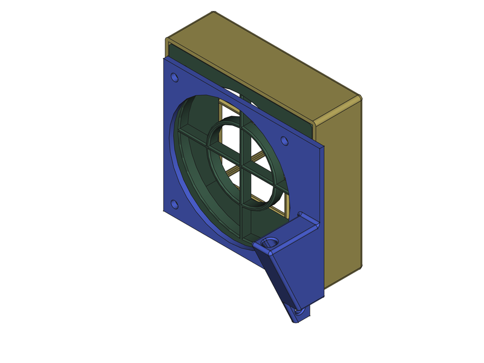

# X-Smart 3 Exhaust Fan Filter

An activated charcoal filter for the exhaust fan. The replacement fan
mount also includes a thermistor mount for monitoring chamber
temperature.

## Parts needed

- Printed parts from the [STLs directory](./STLs/)
- 4 M3x4x5mm heat set inserts
- 4 M3x20mm cap screws
- Activated charcoal filter media, Amazon ASIN:
  [B09F6793ST](https://a.co/d/02k9A120). This package will make 40
  filter squares.

## Instructions

1.  Install heat set inserts into the `filter-base.stl` from the flat
    side.
2.  Remove the fan from the XS3.
3.  Re-install the fan.
    1.  The `fan-mount.stl` goes between the fan and the chamber wall.
    2.  Install the `filter-base.stl` with the arrow pointing up.
4.  Using the `filter-jig.stl` cut the filter media into 60x60mm
    squares.
5.  Install one or two filter squares into the `filter-base.stl`.
6.  Slide `filter-cover.stl` onto the `filter-base.stl` from the top.
    Make sure it clicks into place.

Enjoy your filtered exhaust.
