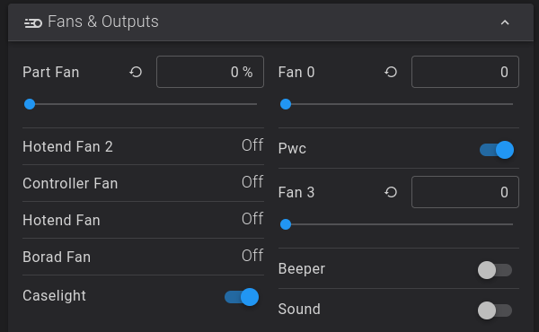

# Mainboard Fan Mod

The mainboard/stepper driver cooling fan runs whenever the printer’s
power is on. This is an annoying 30x10mm fan that makes a high-pitched
hum. The fix is to move the fan’s plug from an always-on socket to one
controlled by Klipper.

This mod is inspired by the Nero3D livestream found here:
https://www.youtube.com/watch?v=ojxxo1QuvFE

In that video, he moves the fan plug to an empty blue socket (at the
11:00 mark). With currently shipping versions, the blue socket is
occupied by the chamber fan. This means a slightly different approach
must be taken.

## Pin and Fan Names

In the default Fluidd interface, the fans are identified as:

- Fan0 on pin (?), this is also the part cooling fan on the extruder.
  The Fan0 slider in the interface will track the level of the part fan
  slider, but can be manually controlled independently of the part fan
  slider.
- Fan2 on pin PA8/FAN0, this is the mainboard fan that ships plugged
  into constant power. The Fluidd slider has no effect.
- Fan3 on pin PC9/FAN1, this is the chamber fan that runs according to
  slicer settings. It is normally off.

After the fan mod, The Fan2 slider will disappear, and a new entry,
`Controller Fan` will be in the list with the hotend fans. It’ll have
changed from a slider to a status indicator.

## The Fix

This mod has two parts. It’s best to do the software first, so that when
the printer is powered up after the hardware change, it’ll have control
over the mainboard fan.

This mod has two parts. It’s best to do the hardware mod first, so that
the printer can be reassembled before making the software changes.

### Hardware

1.  Unplug the printer.
2.  With the printer on its left side, remove the electronics bay cover.
3.  Verify your board matches the [pinout
    diagram](../images/mainboard-pins.jpg).
4.  The fan sockets will be on the bottom edge of the mainboard. Remove
    the white plug in the VIN0 (white) socket, and insert it into the
    FAN1 (green) socket.
5.  Replace the electronics bay cover.
6.  Set the printer upright an power it on.

Wiring before:

Wiring after:

### Software

1.  Verify `printer.cfg` contains the following code block:

<!-- -->

    ##主板上大涡轮风扇
    [output_pin fan2]
    pin: PA8
    pwm: True
    cycle_time: 0.0100
    hardware_pwm: false
    value: 0.00
    scale: 255
    shutdown_value: 0.0

2.  Comment out that code block, and add this code block:

<!-- -->

    [controller_fan controller_fan]
    pin: PA8
    kick_start_time: 0.5

3.  Click the `Save & Restart` button in the top bar, then go to the
    home screen and verify the mod.
4.  Using the interface buttons, home an axis to activate the stepper
    motors. Watch that the `Controller Fan` status changes from `Off` to
    `On`.
