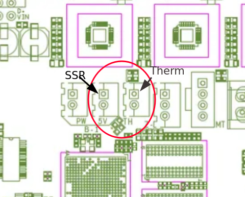
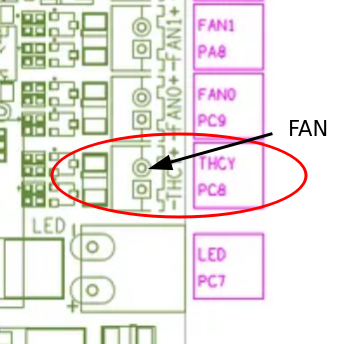
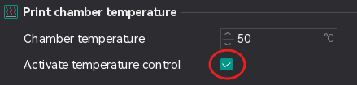

# Chamber Heater Mod

While Qidi states that the **X Smart 3** _can_ print ABS/ASA, the stock printer _can not_ realistically reach an adequate chamber temperature (50℃) with just the hotend and bed heaters. Thankfully the controller board has an adequate number of unused connections to add a dedicated chamber heater.

The parts I used are:

* [10A DC to AC SSR](https://www.amazon.com/gp/product/B09NPKGXMG)
* [350w 110v PTC Heater](https://www.amazon.com/gp/product/B07NY18B6Z)
* [3950 Thermistor](https://www.amazon.com/gp/product/B099K2DKXJ)

## Wiring



Connect your chamber thermistor to the connector marked **TH** as shown above.

The connector to its left (labeled **5v**) can be used as the control pins for the **SSR**.



The PTC heater's fan can be controlled with the port on the right of the board labeled **THCY**.

## Macros and Config

Copy the [heater.cfg](heater.cfg) to your printer and be sure to include it near the bottom of your `printer.cfg`.

With this configuration you can simply check the box in your slicer for chamber temp (as shown below in Orca Slicer's filament settings)



When activated, the generated g-code _should_ heat the chamber to the desired temperature at the start of the print.

Additionally, the delayed g-codes will monitor for the end of the print and engage the printer's exhaust fan to cool the chamber after the print.

### PID Calibration

Once everything is wired and the configuration put in place, I suggest PID tuning the heater with the following:

```
PID_CALIBRATE HEATER=chamber TARGET=60
```
