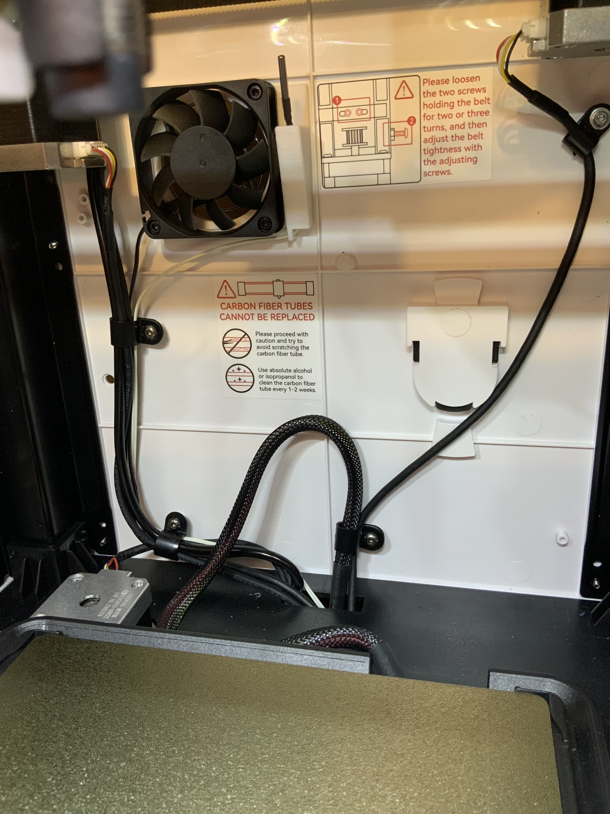

# Thermistor Mount

This is a mount for a chamber thermistor.

## Hardware needed

- 1 thermistor
- 4 M3x20mm cap screws
- 1 printed mount

The STL can be found in this directory,
[xs3-thermistor-mount.stl](./xs3-thermistor-mount.stl). Print as
imported.

The thermistor used can be found on amazon, [3950 NTC 100K Thermistor
Sensor (5 pack)](https://a.co/d/aC1xXPI).

## Tools needed

- 2.5mm hex wrench
- JST-XH terminals and crimpers (optional)

The terminals and crimpers are only needed if shortening the thermistor
leads.

# Installation

1.  Remove the chamber exhaust fan. The fan, fan grill, and nuts will be
    reused.
2.  Install the thermistor into the mount from the bottom.
3.  Using a M3x20mm screw, line up the fan and mount and insert the
    screw into the top right mounting hole.
4.  Loop the thermistor lead through the hook on the bottom of the
    mount.
5.  Install the grill and nut on the screw, but don’t tighten.
6.  Install the other three screws.
7.  Tighten all the screws, making sure the thermistor leads are still
    captured by the mount’s hook.
8.  Adjust the thermistor so the body is above the mount.
9.  Remove the two cable clips on the rear left side of the printer.
10. Route the thermistor lead through the clips.
11. Reattach the cable clips.
12. Route the thermistor lead through the hole in the center rear of the
    chamber floor. Make sure the leads run behind the bed cable.
13. Follow the directions for the [Chamber Heater
    Mod](../heater-mod/README.md) for connection and Klipper
    integration.

